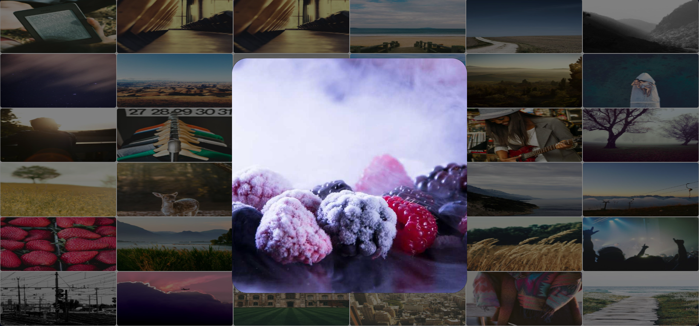

# 🖼️ Basit Resim Galerisi
Sayfamızda toplamda 33 adet rastgele olarak getirilmiş resimler bulunmaktadır
Herhangi bir görsele tıkladığında, o görsel büyük haliyle modal içinde açılıyor.

Basit, kullanışlı ve öğretici 👌

---

## 📸 Ekran Görüntüleri

  
    
  

---

## 🛠️ Kullanılan Teknolojiler

- HTML & CSS (Grid yapısı)
- JavaScript (dinamik kutular ve görseller)
- Bootstrap 5 (modal yapısı için)
- [Picsum.photos](https://picsum.photos) (görselleri rastgele çekmek için)

---
## Kurulum
Bu projeyi yerel ortamınızda çalıştırmak için:

   git clone https://github.com/yekopie/ImageGallery

projeyi klonlayıp Html'i açmanız yeterlidir.

## 👨‍💻 Geliştirici
---
Bu proje [**Yunus Emre Kalaycı**](https://github.com/yekopie) tarafından geliştirilmiştir.  
Fikir, sade ama şık bir görsel galeri oluşturmak 💡

---

Ziyaretiniz için teşekkür ederim ☺️
